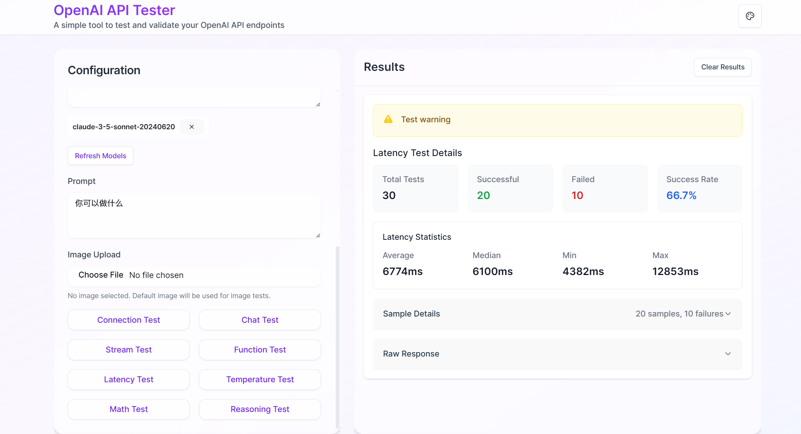

# OpenAI API Tester

<div align="center">



A modern, intuitive web application for testing and validating OpenAI API endpoints. Built with React, TypeScript, and Tailwind CSS.

[Live Demo](http://72.18.83.136:3007/) · [Report Bug](../../issues) · [Request Feature](../../issues)

</div>

## ✨ Features

### 🚀 Comprehensive Testing Suite
- **Chat Completions Testing** - Validate chat model responses
- **Image Analysis** - Test vision model capabilities
- **Function Calling** - Verify function calling implementations
- **Performance Testing**
  - Latency analysis with detailed statistics
  - Temperature variation testing
  - Parallel request handling
- **Specialized Tests**
  - Mathematical operations validation
  - Reasoning capability assessment
  - Custom prompt evaluation

### 🎨 Modern UI/UX
- **Theme Customization**
  - Multiple color schemes
  - Smooth transitions
  - Responsive design
- **Real-time Feedback**
  - Live response streaming
  - Progress indicators
  - Error visualization

### 💻 Developer Tools
- **Request Configuration**
  - Model selection
  - Parameter adjustment
  - Custom headers
- **Response Analysis**
  - JSON inspection
  - Formatted output
  - Error tracking
- **Performance Metrics**
  - Response time tracking
  - Success rate monitoring
  - Consistency analysis

## 🛠️ Tech Stack

- **Frontend Framework**: React 18 with TypeScript
- **Styling**: Tailwind CSS with custom theme system
- **State Management**: Zustand
- **UI Components**: Radix UI primitives
- **Build Tool**: Vite
- **Icons**: Lucide React
- **Testing**: JSON5 for test cases
- **Deployment**: Docker & Nginx

## 🚀 Getting Started

### Prerequisites

- Node.js 16+
- pnpm (recommended) or npm
- Docker & Docker Compose (for containerized deployment)

### Installation

#### Local Development
1. Clone the repository
```bash
git clone https://github.com/Violet-Asuka/openai-api-tester.git
```

2. Install dependencies
```bash
pnpm install
```

3. Start the development server
```bash
pnpm dev
```

4. Build for production
```bash
pnpm build
```

#### Docker Deployment
1. Build and start the container
```bash
docker-compose up -d
```

2. View logs
```bash
docker-compose logs -f
```

3. Stop the service
```bash
docker-compose down
```

4. Rebuild and restart (after code changes)
```bash
docker-compose up -d --build
```

## 📖 Usage

1. Enter your OpenAI API credentials
2. Select the test type you want to run
3. Configure test parameters
4. Execute tests and analyze results

## 🤝 Contributing

Contributions are welcome! Please feel free to submit a Pull Request.

1. Fork the Project
2. Create your Feature Branch (`git checkout -b feature/AmazingFeature`)
3. Commit your Changes (`git commit -m 'Add some AmazingFeature'`)
4. Push to the Branch (`git push origin feature/AmazingFeature`)
5. Open a Pull Request

## 📝 License

This project is open source and available under the MIT License.

## 🙏 Acknowledgments

- OpenAI for their amazing APIs
- The React and Tailwind CSS communities
- All contributors who help improve this project

## 🚀 Deployment Options

### Docker Deployment (Recommended)

The project includes Docker configuration for easy deployment:

```bash
# Clone the repository
git clone https://github.com/Violet-Asuka/openai-api-tester.git
cd openai-api-tester

# Build and start with Docker Compose
docker-compose up -d
```

The application will be available at `http://localhost:80`

### Configuration

- The default port is 80, you can change it in `docker-compose.yml`
- Nginx configuration can be modified in `nginx.conf`
- Environment variables can be added in `docker-compose.yml`

### Vercel Deployment

The easier way to deploy this app is to use the [Vercel Platform](https://vercel.com).

1. Fork this repository
2. Import your fork to Vercel:
   - Go to [Vercel](https://vercel.com)
   - Click "New Project"
   - Select your fork of this repository
   - Vercel will automatically detect the correct settings
3. Deploy! 🎉

[](https://vercel.com/new/clone?repository-url=https%3A%2F%2Fgithub.com%2FViolet-Asuka%2Fopenai-api-tester)

---

<div align="center">
Made with ❤️ by Violet
</div>